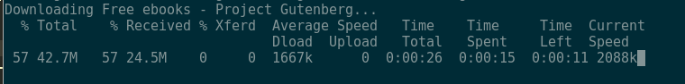
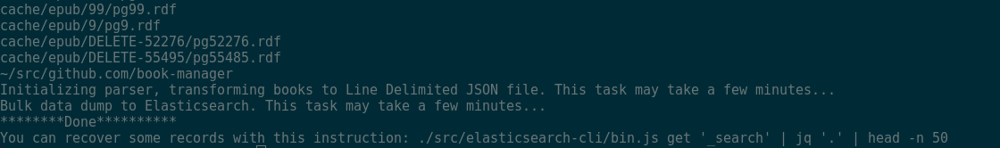

# Book-manager


## Initializing project.

We need the external data used in this project. We use free ebooks from Project Gutenberg and we need to download them.

All e-books are inserted in elasticsearch, so you must
start it before executing the initialization script:

```sh
docker-compose up
```


Then, you must execute the initialize script.
> This action should only be executed the first time.!!!

```sh
./initialize-project.sh
```




After a few minutes:





All books will be in elasticsearch!!!!


When everything is finished, you can recover some records with this instruction:
> [Nodejs](https://nodejs.org) Runtime and the [JQ](https://stedolan.github.io/jq/download/) package must be in your system.


```sh
./src/elasticsearch-cli/bin.js get '_search' | jq '.' | head -n 50
```

```js
{
  "took": 76,
  "timed_out": false,
  "_shards": {
    "total": 5,
    "successful": 5,
    "skipped": 0,
    "failed": 0
  },
  "hits": {
    "total": 58250,
    "max_score": 1,
    "hits": [
      {
        "_index": "books",
        "_type": "book",
        "_id": "pg100",
        "_score": 1,
        "_source": {
          "id": 100,
          "title": "The Complete Works of William Shakespeare",
          "authors": [
            "Shakespeare, William"
          ],

```

You can see more options of the elasticsearch-cli application by running:

```sh
$ ./src/elasticsearch-cli/bin.js


Usage: bin [options] <command> [...]

Options:
  -V, --version          output the version number
  -o, --host <hostname>  hostname [localhost] (default: "localhost")
  -p, --port <number>    port number [9200] (default: "9200")
  -j, --json             format output as JSON
  -i, --index <name>     which index to use
  -t, --type <type>      default type for bulk operations
  -f, --filter <filter>  source filter for query results
  -h, --help             output usage information

Commands:
  get [path]             generate the URL for the options and path (default is /)
  create-index           Create an index in Elasticsearch
  list-indices|li        Get a list of indices in the cluster
  bulk <file>            Read and perform bulk options from the specified file
  query|q [queries...]   Perform an Elasticsearch query
  delete-index           Delete a index in Elasticsearch

```